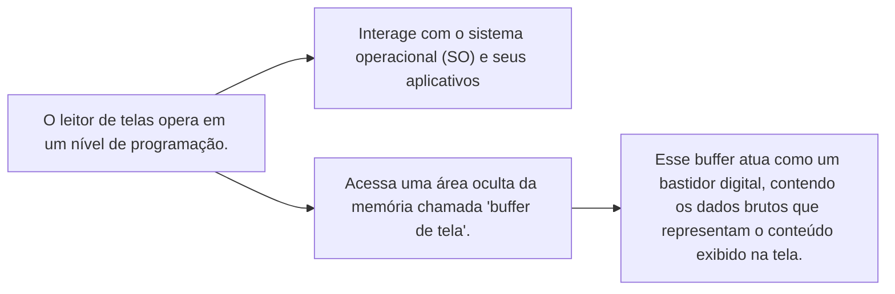
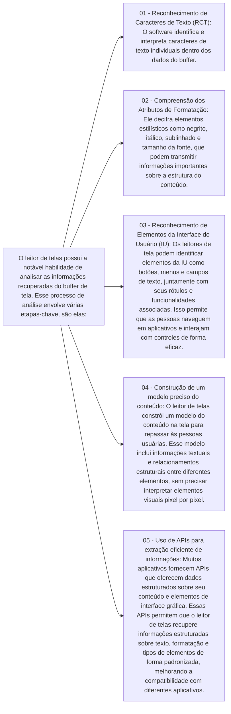
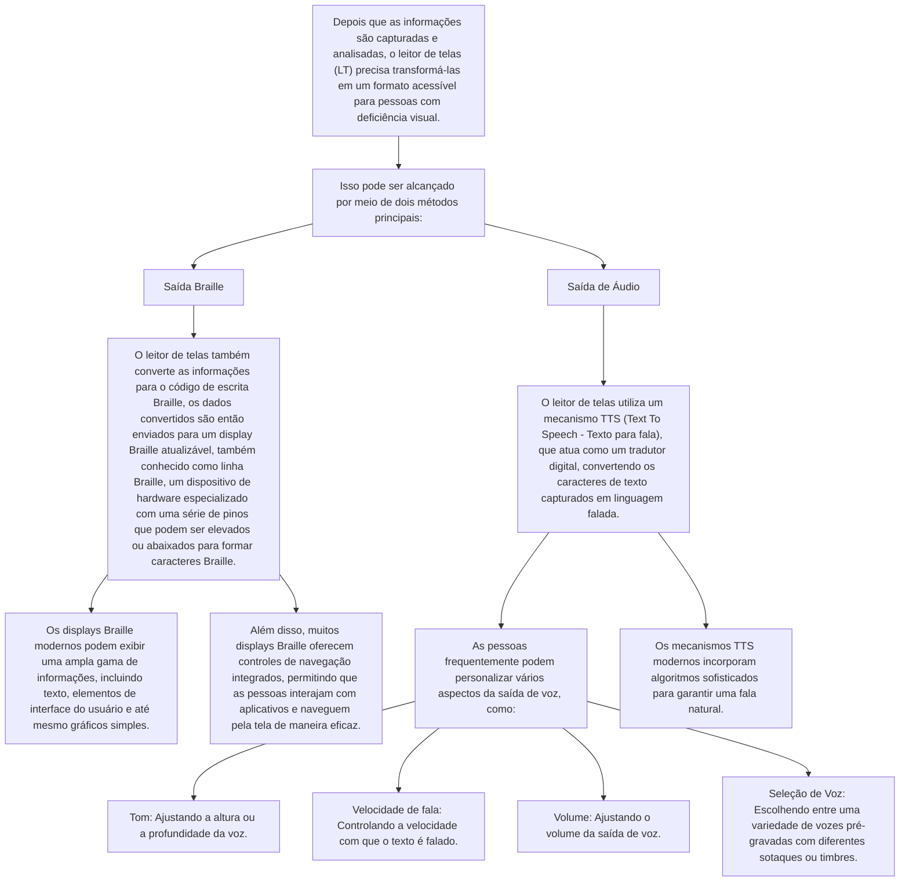

# O que são leitores de tela e como eles funcionam

Softwares leitores de tela são tecnologias assistivas informatizadas, cujo objetivo principal é promover o acesso de pessoas com deficiência visual e pessoas que tenham dificuldades para ler a tela a computadores de mesa, notebooks, smartphones, tablets e outros recursos tecnológicos.

Apesar do nome “leitor de telas”, essa tecnologia não faz a leitura da tela como um “olho humano". A maneira de capturar a informação muda, e, por consequência, também muda a experiência que pessoas usuárias dessas tecnologias têm com sistemas digitais.

## Leitor de telas

Isso significa que o leitor de telas não acessa a tela, mas sim a área de memória do computador onde estão as informações que vão gerar a tela. Que informações são essas? São os algoritmos, dados e saídas de programas que são repassados para serem exibidos para as pessoas.

É como se o leitor de telas interceptasse os bastidores da tela e não a tela em si.

## Funcionamento do leitor de telas

O diagrama anterior mostra como o leitor de telas processa as informações capturadas do buffer de tela. Ele destaca as etapas-chave envolvidas na análise e interpretação de dados brutos para criar uma representação acessível do conteúdo exibido na tela.

## Saída de Informações Acessíveis

O diagrama anterior destaca os métodos de saída de informações acessíveis usados pelos leitores de tela para fornecer feedback auditivo e tátil para pessoas com deficiência visual. Ele descreve como os leitores de tela convertem dados brutos em formatos acessíveis, como Braille e saída de áudio, para facilitar a interação com sistemas digitais.

## Quais leitores de tela estão disponíveis para cada sistema operacional?

- **Windows**:
  - [Narrador](https://support.microsoft.com/pt-br/windows/guia-completo-do-narrador-e4397a0d-ef4f-b386-d8ae-c172f109bdb1) (da própria Microsoft)
  - [JAWS](https://www.freedomscientific.com/products/software/jaws/) (Job Access With Speech da empresa Freedom Scientific)
  - [NVDA](https://www.nvaccess.org/) (NonVisual Desktop Access da organização NV Access)
- **MacOS**:
  - [VoiceOver](https://support.apple.com/pt-br/guide/voiceover/welcome/mac) (da própria Apple)
- **Linux**:
  - [Orca](https://help.gnome.org/users/orca/stable/) (mantido pela comunidade e pela GNOME software)
- **Android**:
  - [TalkBack](https://support.google.com/accessibility/android/answer/6283677) (da própria Google)
  - [Jshuo](https://ciata.org.br/jieshuo) (leitor chinês)
- **iOS**:
  - [VoiceOver](https://support.apple.com/pt-br/guide/iphone/iph3e2e415f/ios) (da própria Apple, possui o mesmo nome do leitor de telas do MacOS, mas são softwares diferentes - um é para desktop e o outro para dispositivos móveis)

### Comparativo entre os leitores de tela

| Leitor de Tela      | Sistema Operacional | Tipo de Software | Tipo de Acesso      |
|---------------------|---------------------|-------------------|---------------------|
| Narrador            | Windows             | Proprietário      | Gratuito            |
| JAWS                | Windows             | Proprietário      | Pago (licença)      |
| NVDA                | Windows             | Livre             | Gratuito¹           |
| VoiceOver           | MacOS               | Proprietário      | Gratuito            |
| Orca                | Linux               | Livre             | Gratuito            |
| TalkBack            | Android             | Proprietário      | Gratuito            |
| Jshuo               | Android             | Proprietário      | Gratuito²           |
| VoiceOver           | iOS                 | Proprietário      | Gratuito            |

**Legenda:**

¹ NVDA é gratuito, mas aceita doações para sustentar o projeto.
² Jshuo é amplamente gratuito na China, mas pode ter funcionalidades premium dependendo da versão.

**Observações:**

- O VoiceOver é o leitor de telas padrão para MacOS e iOS, e é desenvolvido pela própria Apple, ele é gratuito e já vem instalado nos sistemas operacionais da empresa o que significa que você deve ter os dispositivos da Apple (MacBook, iMac, iPhone, iPad, etc.) para utilizá-lo.

- O Narrador é um leitor de telas desenvolvido pela Microsoft e é gratuito, ele já vem instalado no Windows, mas é recomendado para iniciantes, pois não possui tantas funcionalidades quanto o JAWS e o NVDA.

- O Jshuo é um leitor de telas chinês que vem ganhando popularidade, ele é gratuito e possui funcionalidades semelhantes ao TalkBack da Google. Ele não está disponível na Play Store, mas pode ser baixado diretamente do site oficial ou pelo instalador APK que pode ser encontrado em fóruns e grupos de discussão para pessoas com deficiência visual.
