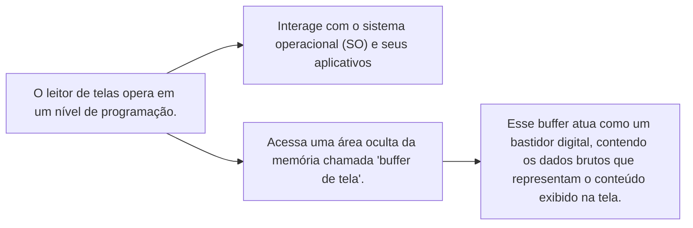
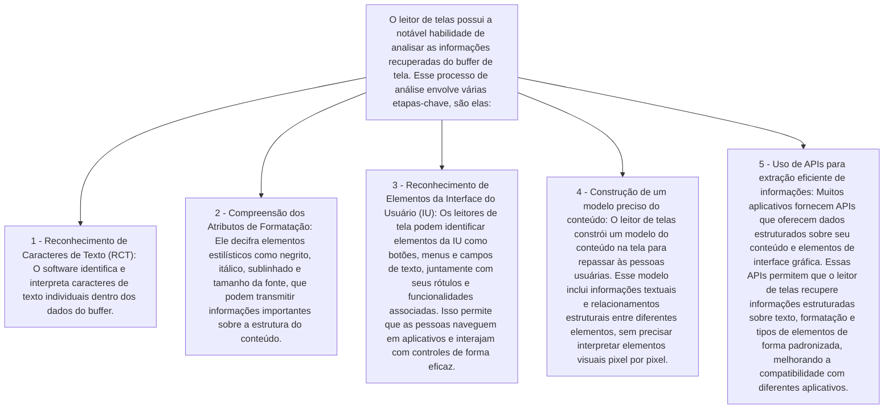
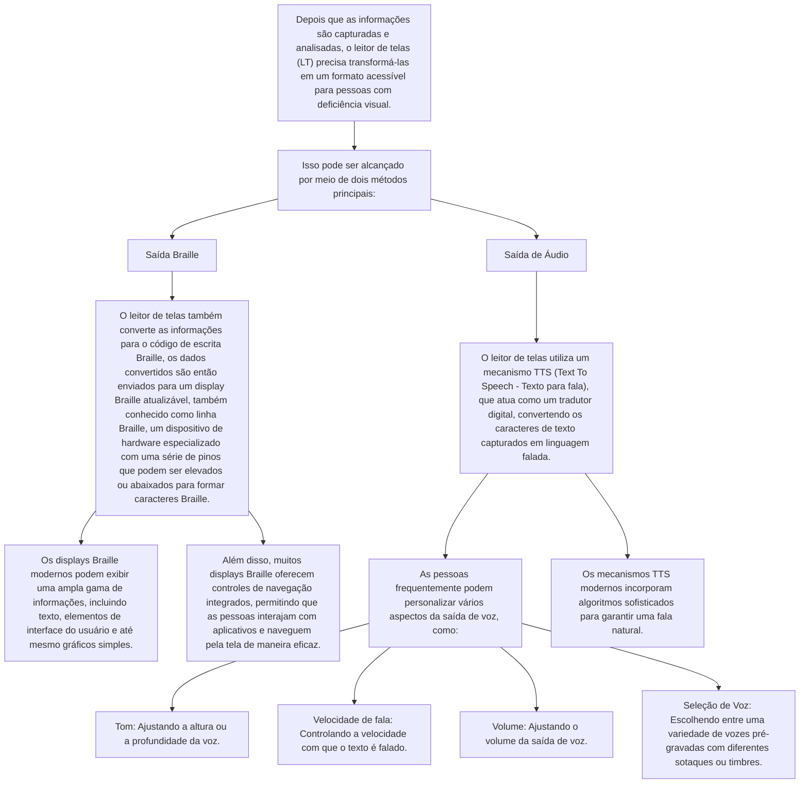

# Softwares leitores de tela e os problemas de acessibilidade para ele no Miro

## O que são leitores de tela e como eles funcionam

Softwares leitores de tela são tecnologias assistivas informatizadas, cujo objetivo principal é promover o acesso de pessoas com deficiência visual e pessoas que tenham dificuldades para ler a tela a computadores de mesa, notebooks, smartphones, tablets e outros recursos tecnológicos.

Apesar do nome “leitor de telas”, essa tecnologia não faz a leitura da tela como um “olho humano". A maneira de capturar a informação muda, e, por consequência, também muda a experiência que pessoas usuárias dessas tecnologias têm com sistemas digitais.

## Leitor de telas

Isso significa que o leitor de telas não acessa a tela, mas sim a área de memória do computador onde estão as informações que vão gerar a tela. Que informações são essas? São os algoritmos, dados e saídas de programas que são repassados para serem exibidos para as pessoas.

É como se o leitor de telas interceptasse os bastidores da tela e não a tela em si.

## Funcionamento do leitor de telas

O diagrama anterior mostra como o leitor de telas processa as informações capturadas do buffer de tela. Ele destaca as etapas-chave envolvidas na análise e interpretação de dados brutos para criar uma representação acessível do conteúdo exibido na tela.

## Saída de Informações Acessíveis

O diagrama anterior destaca os métodos de saída de informações acessíveis usados pelos leitores de tela para fornecer feedback auditivo e tátil para pessoas com deficiência visual. Ele descreve como os leitores de tela convertem dados brutos em formatos acessíveis, como Braille e saída de áudio, para facilitar a interação com sistemas digitais.

## Quais leitores de tela estão disponíveis para cada sistema operacional?

- **Windows**:
  - [Narrador](https://support.microsoft.com/pt-br/windows/guia-completo-do-narrador-e4397a0d-ef4f-b386-d8ae-c172f109bdb1) (da própria Microsoft)
  - [JAWS](https://www.freedomscientific.com/products/software/jaws/) (Job Access With Speech da empresa Freedom Scientific)
  - [NVDA](https://www.nvaccess.org/) (NonVisual Desktop Access da organização NV Access)
- **MacOS**:
  - [VoiceOver](https://support.apple.com/pt-br/guide/voiceover/welcome/mac) (da própria Apple)
- **Linux**:
  - [Orca](https://help.gnome.org/users/orca/stable/) (mantido pela comunidade e pela GNOME software)
- **Android**:
  - [TalkBack](https://support.google.com/accessibility/android/answer/6283677) (da própria Google)
  - [Jshuo](https://ciata.org.br/jieshuo) (leitor chinês)
- **iOS**:
  - [VoiceOver](https://support.apple.com/pt-br/guide/iphone/iph3e2e415f/ios) (da própria Apple, possui o mesmo nome do leitor de telas do MacOS, mas são softwares diferentes - um é para desktop e o outro para dispositivos móveis)

### Comparativo entre os leitores de tela

| Leitor de Tela      | Sistema Operacional | Tipo de Software | Tipo de Acesso      |
|---------------------|---------------------|-------------------|---------------------|
| Narrador            | Windows             | Proprietário      | Gratuito            |
| JAWS                | Windows             | Proprietário      | Pago (licença)      |
| NVDA                | Windows             | Livre             | Gratuito¹           |
| VoiceOver           | MacOS               | Proprietário      | Gratuito            |
| Orca                | Linux               | Livre             | Gratuito            |
| TalkBack            | Android             | Proprietário      | Gratuito            |
| Jshuo               | Android             | Proprietário      | Gratuito²           |
| VoiceOver           | iOS                 | Proprietário      | Gratuito            |

**Legenda:**

¹ NVDA é gratuito, mas aceita doações para sustentar o projeto.
² Jshuo é amplamente gratuito na China, mas pode ter funcionalidades premium dependendo da versão.

**Observações:**

- O VoiceOver é o leitor de telas padrão para MacOS e iOS, e é desenvolvido pela própria Apple, ele é gratuito e já vem instalado nos sistemas operacionais da empresa o que significa que você deve ter os dispositivos da Apple (MacBook, iMac, iPhone, iPad, etc.) para utilizá-lo.

- O Narrador é um leitor de telas desenvolvido pela Microsoft e é gratuito, ele já vem instalado no Windows, mas é recomendado para iniciantes, pois não possui tantas funcionalidades quanto o JAWS e o NVDA.

- O Jshuo é um leitor de telas chinês que vem ganhando popularidade, ele é gratuito e possui funcionalidades semelhantes ao TalkBack da Google. Ele não está disponível na Play Store, mas pode ser baixado diretamente do site oficial ou pelo instalador APK que pode ser encontrado em fóruns e grupos de discussão para pessoas com deficiência visual.

## Diferenças da experiência de uso visual em relação ao uso com leitor de telas

A experiência de uma pessoa visual difere significativamente da de uma pessoa cega que utiliza um leitor de tela, pois quem enxerga pode ver a tela e interagir com os elementos visuais, enquanto quem utiliza um leitor de telas depende de feedback auditivo e tátil para acessar informações e interagir com sistemas digitais.

- **Pessoas Visuais**:
  - fazem um acesso multidimensional à informação, ou seja, podem acessar informações visuais da tela de forma simultânea e na ordem que desejarem.
  - podem ver elementos visuais como imagens, gráficos, vídeos e animações.
  - possuem uma panorâmica visual da tela, o que facilita a navegação e a localização de informações mesmo que em um primeiro acesso.

- **Pessoas com Deficiência Visual**:
  - fazem um acesso sequencial à informação, ou seja, acessam informações de forma linear e sequencial, seguindo a ordem de leitura do leitor de telas.
  - não podem ver elementos visuais, como imagens, gráficos, vídeos e animações, a menos que sejam descritos pelo leitor de telas.
  - dependem de feedback auditivo e tátil para acessar informações e interagir com sistemas digitais.
  - A navegação depende de comandos específicos.
  - Em dispositivos móveis, a interação ocorre por meio de gestos específicos.
  - Leitores de tela usam semântica adequada para identificar cabeçalhos, listas, botões e outros elementos da interface.

### Comparativo entre as experiências de uso

A tabela a seguir compara a experiência de uso de pessoas visuais e pessoas com deficiência visual que utilizam leitores de tela para acessar informações e interagir com sistemas digitais.

| **Recurso**             | **Pessoa visual**                                       | **PcD que usa leitor de telas**                                |
|-------------------------|----------------------------------------------------------|-----------------------------------------------------------------|
| **Localizar Informações** | Pode escanear rapidamente                               | Precisa navegar sequencialmente                                |
| **Clicar em um Elemento** | Usa mouse ou toque direto                              | Usa atalhos de teclado ou gestos                               |
| **Compreensão da Interface** | Vê toda a estrutura de uma vez                      | Depende da descrição do leitor de tela                         |
| **Velocidade de Acesso** | Identifica e interage rapidamente                      | Necessita explorar cada elemento                               |

### Exemplos de atalhos usados com leitores de tela

Os atalhos de teclado e gestos em tela sensível ao toque são essenciais para pessoas com deficiência visual que utilizam leitores de tela para acessar informações e interagir com sistemas digitais. Esses atalhos permitem que as pessoas naveguem rapidamente, ativem elementos interativos e acessem informações de forma eficiente.

## Atalhos de Teclado

| Sistema | Atalho | Função |
|---------|--------|--------|
| **Windows + NVDA** | `NVDA + Seta para Baixo` | Ler tudo |
| **Windows + NVDA** | `NVDA + T` | Ler o título da janela atual |
| **Windows + NVDA** | `Tab` | Ir para o próximo elemento interativo |
| **Mac + VoiceOver** | `VO + Seta Direita` | Mover para frente |
| **Mac + VoiceOver** | `VO + Barra de Espaço` | Ativar item |

## Gestos em Tela Sensível ao Toque (iOS & Android)

| Gesto | Função |
|--------|--------|
| **Deslizar para a Direita** | Ir para o próximo item |
| **Deslizar para a Esquerda** | Ir para o item anterior |
| **Toque Duplo** | Ativar item |

### Para saber mais

Para mais informações sobre o uso detalhado de leitores de tela, consulte as leituras introdutórias a seguir:

- [Leitor de telas: NVDA - primeiros passos](https://www.pcdnaescola.com.br/artigos-tecnologia-leitor-de-telas-nvda-primeiros-passos)
- [Usando o Windows 11 com o NVDA](https://www.pcdnaescola.com.br/artigos-tecnologia-usando-o-windows-11-com-o-nvda)
- [Google Chrome com NVDA](https://www.pcdnaescola.com.br/artigos-tecnologia-google-chrome-com-nvda)
- [Visual Studio Code com NVDA](https://www.pcdnaescola.com.br/artigos-tecnologia-vs-code-com-nvda)
- [Manual de Uso do VoiceOver para macOS](https://support.apple.com/pt-br/guide/voiceover/welcome/mac)
- [Orca Screen Reader](https://help.gnome.org/users/orca/stable/index.html.pt_BR)

## Exemplos de uso do leitor de telas

Serão demonstradas a seguir algumas situações de uso de leitores de tela em diferentes contextos de acesso a sistemas digitais.

Mais adiante serão apresentados padrões de acessibilidade de acordo com a WCAG - Web Content Accessibility Guidelines (Diretrizes de Acessibilidade para Conteúdo Web). Por enquanto é importante saber que os sites, aplicações web e aplicativos tem suas experiências de uso divididas em diferentes níveis de conformidade com as diretrizes de acessibilidade.

**Estes níveis de conformidade são:**

- **A (Adequado)**: O nível mais básico de conformidade, que garante a acessibilidade mínima para pessoas com deficiência.
- **AA (Duplamente Adequado)**: Um nível intermediário de conformidade, que oferece um nível mais alto de acessibilidade.
- **AAA (Triplamente Adequado)**: O nível mais alto de conformidade, que oferece a melhor acessibilidade possível para pessoas com deficiência.

Antes do nível **A**, o projeto não é considerado acessível, muitas pessoas costumam chamar este limbo de **"acessáveis"**. Estes são projetos que não estão em conformidade com as diretrizes de acessibilidade, mas que possuem algumas características que facilitam o acesso de pessoas com deficiência, mesmo que com uma experiência de navegação restrita, muitas vezes cansativa e frustrante.

Infelizmente não se tem registros no Brasil de projetos de software que atendam ao nível **AAA** de conformidade com as diretrizes de acessibilidade, no entanto, é possível encontrar projetos que atendam ao nível **AA** e **A**.

### Exemplos em vídeo de uso do leitores de tecnologias

Para explicar melhor como ocorre a interação de pessoas com deficiência visual com sistemas digitais, vamos apresentar alguns exemplos em vídeo de uso de leitores de tela em diferentes contextos.

Foram gravados três vídeos curtos, cada um mostrando uma situação de uso de leitor de tela em um contexto específico:

1. **Navegação em um site acessável**: Demonstração de como uma pessoa com deficiência visual navega em um site com problemas sérios de acessibilidade, mas que ainda é possível de ser utilizado com um leitor de tela.

[▶ Demonstração de uma pessoa utilizando um leitor de tela em um site acessável](https://player-vz-480faebf-94f.tv.pandavideo.com.br/embed/?v=bdc7cd76-ccbe-4998-baa3-e2a12cf7648e)

2. **Navegação em um site acessível**: Demonstração de como uma pessoa com deficiência visual navega em um site que possui rótulos, semântica e estrutura adequados, facilitando a interação com um leitor de tela.

[▶ Demonstração de uma pessoa utilizando um leitor de tela em um site acessível](https://player-vz-480faebf-94f.tv.pandavideo.com.br/embed/?v=5c63d92d-b479-45b8-9261-c0a981b19b5c)

3. **Navegação no dashboard do Miro**: Demonstração de como uma pessoa com deficiência visual navega em um aplicativo web que possui problemas de acessibilidade, como falta de rótulos, semântica inadequada e estrutura confusa.

[▶ Demonstração de uma pessoa utilizando um leitor de tela no dashboard do Miro](https://player-vz-480faebf-94f.tv.pandavideo.com.br/embed/?v=cf5dbc92-cfe5-431a-8c49-34980a297dac)

## Miro e a acessibilidade para leitores de tela

Durante a análise de acessibilidade foram identificados alguns comportamentos inconsistentes que impactam a experiência de navegação. Em determinadas situações, cujo contexto exato ainda não foi definido, pois as pessoas que realizaram a análise são pessoas com deficiência visual dependentes de feedback do leitor de telas, o foco do leitor se perde e retorna automaticamente para o primeiro botão da página, fora do board.

Além disso, alguns elementos dentro do board tornam-se inacessíveis dependendo da forma como são utilizados. Um exemplo observado foi uma tabela inserida dentro de um frame. Embora o frame em si pudesse ser acessado, a tabela deixava de responder ao comando para sua ativação, impossibilitando a interação.

Outro problema identificado refere-se à navegação entre os elementos utilizando as setas do teclado. Em alguns casos, ao mover o foco para a direita do elemento A para o elemento B, a tentativa de retornar ao elemento A utilizando a seta para a esquerda resultava no deslocamento para um item completamente diferente, sem um padrão previsível.

Ao explorar mais profundamente a plataforma, verificou-se que era possível inserir itens, editar textos e modificar propriedades visuais. No entanto, os maiores desafios permaneceram na navegação espacial, na movimentação de elementos dentro do board e na acessibilidade das tabelas.

Embora fosse possível mover itens no board, não havia nenhuma indicação clara sobre a posição exata desses elementos, se estavam próximos ou sobrepostos a outros itens. Por outro lado, foi possível inserir novos itens tanto dentro de frames específicos quanto soltos no board, mas não foi possível identificar a posição exata desses elementos e os nomes das colunas que integravam.

## Tabela organizada de bugs encontrados de acordo com a WCAG

| Problema | Critério WCAG Violado | Solução/Correção |
|----------|-----------------------|------------------|
| **Perda de foco inesperada:** O foco do leitor de tela é perdido e, em certos momentos, retorna automaticamente para o primeiro botão fora do board. | **WCAG 2.4.3 – Ordem de Foco:** A ordem de foco deve ser lógica e previsível.   **WCAG 3.2.1 – On Focus:** Mudanças de contexto não devem ocorrer sem que a pessoa usuária esteja informada. | - Revisar e ajustar a gestão do foco, assegurando que, ao interagir com elementos do board, o foco permaneça ou retorne ao item esperado.  - Evitar alterações automáticas do foco sem aviso prévio. - Utilizar atributos como `tabindex` e, quando necessário, técnicas ARIA (ex.: `aria-activedescendant`) para controlar a ordem e a visibilidade do foco.  - Implementar testes com leitores de tela para confirmar que o comportamento do foco está consistente e previsível. |
| **Navegação com as setas inconsistente:** Ao usar as teclas de seta para navegar entre elementos, o foco pode não retornar ao elemento imediatamente anterior e, em alguns casos, desviar para um item totalmente diferente. | **WCAG 2.1.1 – Acesso via Teclado:** Toda funcionalidade deve estar operável via teclado.   **WCAG 2.4.3 – Ordem de Foco:** A ordem de foco deve refletir a lógica da interface. | - Garantir que a navegação via teclado (incluindo as teclas de seta) siga a ordem definida no DOM e a organização visual do conteúdo.  - Revisar a implementação dos eventos de teclado, certificando-se de que os handlers (por exemplo, os eventos `keydown` ou `keyup`) direcionem o foco para o elemento correto.  - Implementar atributos ARIA (quando necessário) para reforçar a relação entre os elementos e definir uma ordem de navegação intuitiva. - Realizar testes de usabilidade com diferentes tecnologias assistivas para confirmar que a navegação é consistente e previsível. |
| **Tabela não responsiva dentro de um frame:** Apesar do frame ser acessível, a tabela interna não responde aos comandos de acesso, impedindo a interação adequada com o conteúdo. | **WCAG 4.1.2 – Nome, Função e Valor:** Os componentes interativos devem ter seus papéis, nomes e valores programaticamente determinados.   **WCAG 2.1.1 – Acesso via Teclado:** Elementos interativos devem responder aos comandos do teclado. | - Revisar a implementação tanto do frame quanto da tabela para garantir que os eventos de interação (especialmente os de teclado) sejam propagados corretamente.  - Certificar-se de que os elementos da tabela possuam atributos semânticos ou ARIA que indiquem seu papel e estado (por exemplo, utilizando `role="table"`, `role="row"`, `role="gridcell"` ou outros, conforme o caso).  - Ajustar scripts e handlers para que, ao receber um comando, a tabela reaja de forma consistente e integrada à árvore de acessibilidade.  - Validar as alterações com ferramentas de avaliação de acessibilidade e testes práticos com leitores de tela. |
| **Falta de indicação do posicionamento dos itens no board:** Ao movimentar itens, não há um feedback acessível que informe a posição relativa ou a relação espacial entre os elementos, dificultando a compreensão da organização do conteúdo. | **WCAG 1.3.1 – Informação e Relação:** A estrutura e as relações entre os elementos devem ser comunicadas de forma programática para que tecnologias assistivas possam interpretá-las.   **WCAG 2.4.7 – Foco Visível (quando aplicável):** Indicadores visuais (ou auditivos, no caso de leitores de tela) do foco ajudam na compreensão da posição atual. | - Implementar feedback acessível (por exemplo, via ARIA live regions) para comunicar alterações de posição dos itens à pessoa usuária.  - Fornecer descrições ou rótulos dinâmicos que indiquem a posição ou a relação espacial (ex.: "Item X, posição 2 de 5", "Item sobreposto ao item Y").  - Se a interface possuir elementos visuais para indicar posição, assegurar que essas informações sejam replicadas em texto ou através de atributos acessíveis, permitindo que a organização espacial seja compreendida também por meio do leitor de tela. - Testar a usabilidade com foco na experiência de navegação espacial para confirmar que as informações de posicionamento estão sendo comunicadas de foext install yzane.markdown-pdfrma clara e oportuna. |

## Referências

- [WCAG 2.2 - Web Content Accessibility Guidelines](https://guia-wcag.com/)
- [ARIA - Accessible Rich Internet Applications](https://developer.mozilla.org/pt-BR/docs/Web/Accessibility/ARIA)
